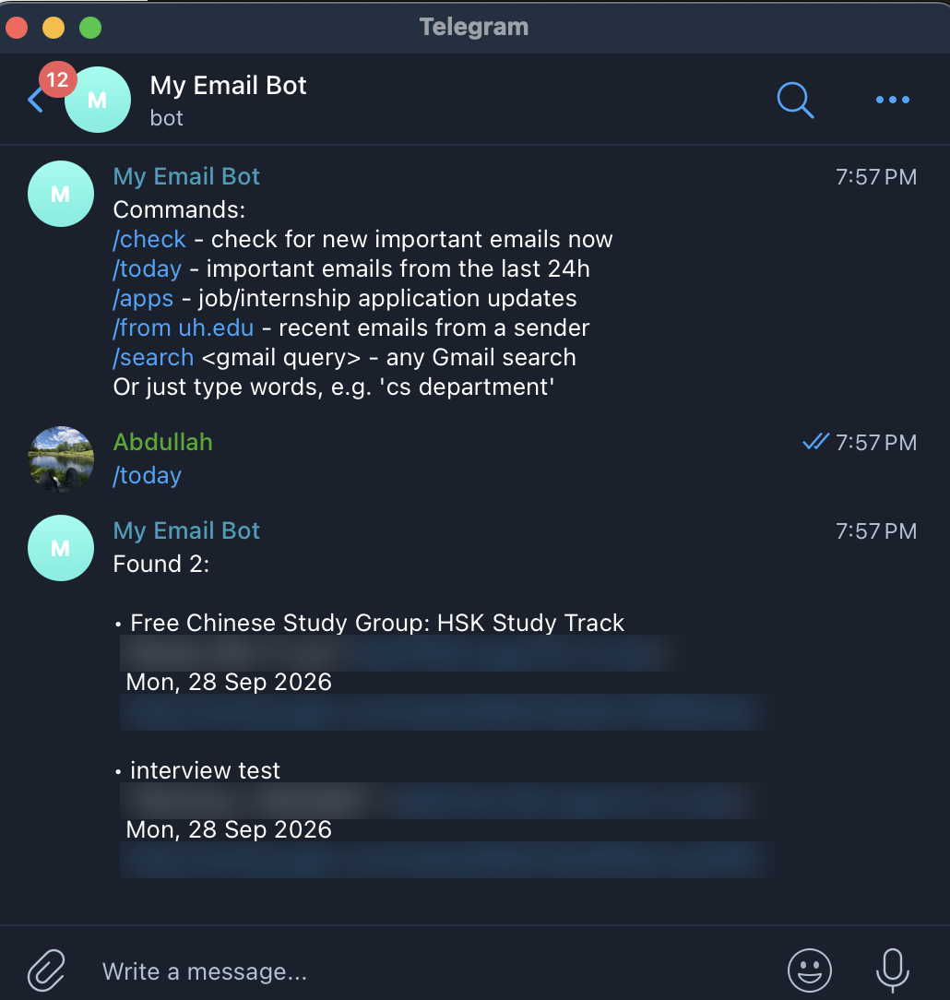
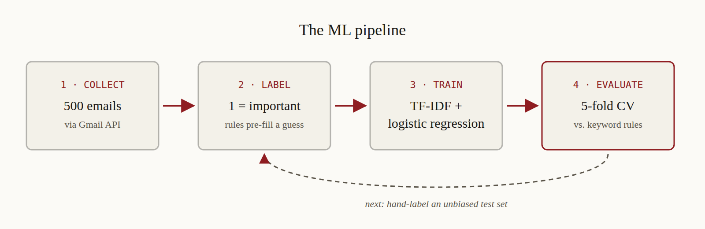

## The Problem

I have two inboxes: my personal Gmail and my University of Houston account, which runs on Microsoft 365. The emails I actually care about, like a reply from the CS department, an update on an internship application, or a decision on a transfer credit petition, were buried under newsletters, promotions, and job-board digests. Finding them meant searching both inboxes by hand, and sometimes I found out about something days late.

What I wanted was simple: type something like *"did the CS department reply?"* or *"any internship updates?"*, and get notified the moment something important arrives, without checking two inboxes all day.

## Architecture: How It Works

```
┌────────────────┐  auto-forward  ┌────────────────┐
│  UH Outlook    │ ─────────────▶ │     Gmail      │
└────────────────┘                └───────┬────────┘
                                          │ Gmail API
                                          │ (read-only OAuth)
                                          ▼
                              ┌────────────────────────┐
                              │  bot.py                │
                              │  Google Cloud VM, 24/7 │
                              │                        │
                              │  1. importance filter  │
                              │  2. privacy layer      │
                              └───────────┬────────────┘
                                          │ Telegram Bot API
                                          ▼
                              ┌────────────────────────┐
                              │  my phone (Telegram)   │
                              │  alerts + commands     │
                              └────────────────────────┘
```

1. **One inbox.** Instead of connecting two email systems, I set up auto-forwarding from my UH Outlook to Gmail, with a Gmail filter that labels school mail. The bot only has to read one place.
2. **Read.** Every 15 minutes, the bot asks the Gmail API for recent emails. It signs in with OAuth using a **read-only** scope, so it can look at my mail but can never send, delete, or change anything.
3. **Decide.** An importance filter scores each email using trusted senders (UH offices, recruiting systems like Ashby and Greenhouse) and keywords ("interview," "petition," "next steps," "not selected").
4. **Protect.** Before anything leaves the server, a privacy layer hides details from sensitive senders (banks, government, financial aid) and masks long numbers like my student ID.
5. **Notify.** Important emails go to my private Telegram chat, never twice for the same one.
6. **Ask.** The same loop listens for commands from my phone: `/today`, `/apps` for application updates, `/from uh.edu`, or any Gmail search.



That screenshot also shows the filter's weakness honestly: a study-group announcement got flagged just because it came from a UH address. That kind of false positive is exactly what the ML part below is meant to fix.

## Security

Since this bot can read my email, security wasn't an afterthought:

- **Least privilege:** read-only Gmail access, so the worst case of a leaked key is someone *reading* mail, not sending it.
- **It only answers me.** Anyone on Telegram can find and message a bot, so every message is checked against my chat ID and everything else is ignored.
- **Nothing sensitive leaves the machine.** Bank, government, and financial aid emails are sent as "open in Gmail" plus a link, never their content.
- **Secrets stay secret.** OAuth tokens and the Telegram token are excluded from Git, locked with file permissions, and scrubbed from error messages so they never land in server logs.
- **A hardened server.** The bot runs as a non-root systemd service, opens no inbound ports (it polls Telegram instead of receiving webhooks), and the server gets automatic security updates.

## Machine Learning

My keyword rules flagged **188 of 500 recent emails (38%)** as important, which is too noisy. So I built a full ML pipeline to try to do better:



1. **Collect:** exported 500 emails (sender, subject, preview) through the Gmail API, handling rate limits with exponential backoff.
2. **Label:** marked each email important or not, with the rules pre-filling a first guess.
3. **Train:** TF-IDF features and logistic regression with class weighting, since important emails are the minority.
4. **Evaluate:** 5-fold cross-validation, so every email is scored by a model that never saw it.

The model reached **0.96 precision and 0.85 recall** on the important class. But the honest takeaway is more interesting than the number: because my labels started from the rules' guesses and I kept them, the model mostly learned to *reproduce the rules*. The scores measure agreement with my rules, not true importance. That's **label bias**, and it's the next thing to fix, with a fresh, independently hand-labeled test set.

## Tech Stack & How I Built It

- **Language:** Python 3.13
- **Email:** Gmail API with Google OAuth 2.0
- **Notifications:** Telegram Bot API (long polling)
- **ML:** scikit-learn and pandas
- **Hosting:** Google Cloud Compute Engine (e2-micro, Debian 13), systemd
- **Tooling:** Git and GitHub, VS Code

I built this with Claude as a pair programmer. I chose a learn-by-building approach: build each piece first, then go back and understand the concepts behind what we did.

Here are some of the prompts that shaped the project:


**Checking cost before starting:** "Before we start, this project is going to be free and run free, right?"

**Making security a habit:** after each new feature, "Until now we built the app, how is the safety condition?" This question led to the privacy layer, token scrubbing, and server hardening.

## What I Learned

**`git status` saved my secrets.** My first push almost uploaded my OAuth credentials, my Gmail token, and my Telegram bot token. My Mac had saved the ignore file as `gitignore` instead of `.gitignore`, so Git didn't recognize it. I only caught it because I read the `git status` list before committing. Now I check it before every commit.

**"It works" and "it's running" are different things.** At one point my bot stopped answering, and I thought something was broken. It wasn't: I had stopped the script to run Git commands in the same terminal. That's exactly why hosting matters, and why the bot now runs as a service that restarts itself.

**"Free tier" needs reading carefully.** The server itself is free, but a public IPv4 address can cost a few dollars a month. I set a $1 budget alert so I'd know before any surprise.

**Garbage in, garbage out, including your own labels.** A 93% accuracy score looked great until I realized what it was measuring. Understanding *why* a number is high turned out to matter more than the number.

**Not every project has to be an invention.** AI assistants can already answer questions about your inbox. Building this myself taught me APIs, OAuth, Linux servers, and threat modeling, things I wouldn't have learned by just asking an assistant.
